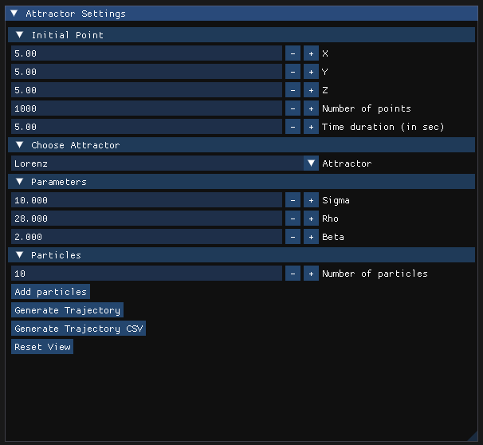
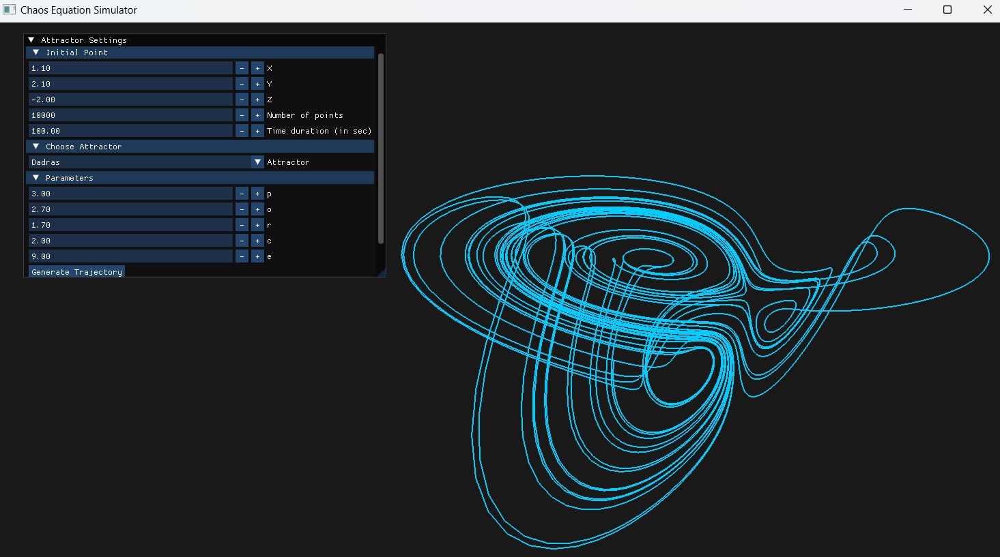
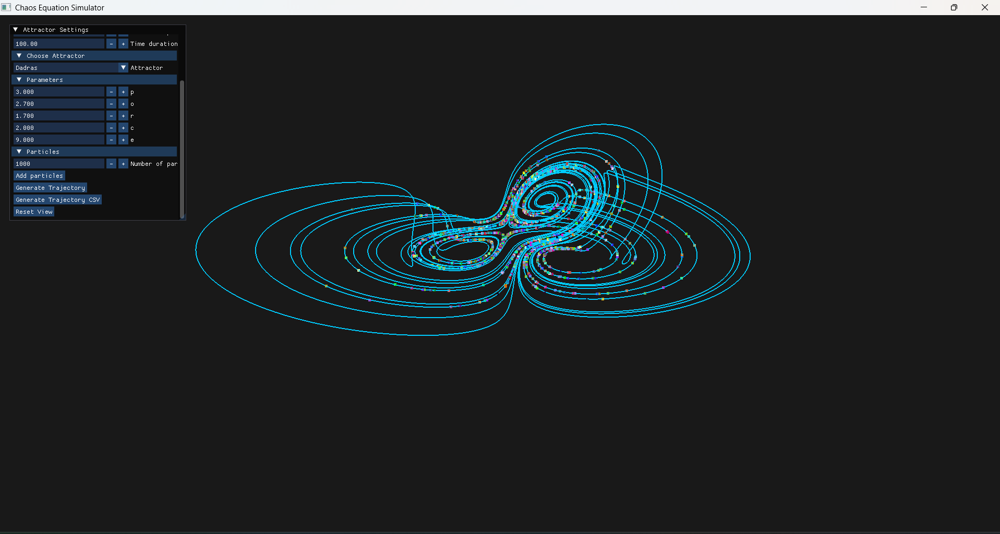

# 💫 ChaosEquationSimulator

## **Description**  
An interactive OpenGL + ImGui application to visualize and explore chaotic attractors in 3D. Supports real-time parameter editing, camera control, and multiple attractor types with dynamic trajectories.

## 📑**Table of Contents**     
- [Features](#features)
- [Supported attractors](#supported_attractors)
- [Tech Stack](#teck-stack)
- [Installation](#installation) 
- [How to use](#how-to-use)
- [Demo](#demo)
- [Acknowledgements](#acknowledgements)
- [References](#references)

## 🧩**Features**
- 🌀 3D Visualization of 15 different chaotic attractors
- Saving trajectory as a CSV file
- 🎛️ Interactive GUI using ImGui for:
    - Selecting attractor types
    - Adjusting equation parameters
    - Setting initial conditions

- 🖱️ Mouse Controls:
    - Rotate camera with left-click drag
    - Pan with right-click drag
    - Zoom with scroll
    - Reset view with R key or "Reset view" button

- ✨ Particle simulation along trajectories

## **🧠 Supported Attractors**
- Lorenz
- Rössler
- Dequan Li
- Aizawa
- Chen Lee
- Arneodo
- Sprott B
- Sprott Linz F
- Dadras
- Halvorsen
- Thomas
- Lorenz83
- Rabinovich-Fabrikant
- Four-Wing 
- Sprott

Each attractor uses its own set of parameters, which update dynamically when selected.

## 🛠️ **Tech Stack**
- **C++ 11 or higher**
- **OpenGL**
- **GLFW 3.4** 
- **GLAD**
- **GLM 1.0.1** 
- **ImGUI v1.91.9b** 
- **A C++ compiler (GCC, Clang, etc.)** 
 
## 🧪**Installation**  
1. Clone or download the repository
<pre> git clone https://github.com/Alicia105/ChaosEquationSimulator.git </pre>

2. Navigate to the project directory
<pre> cd ChaosEquationSimulator </pre>

3. Create a build directory
<pre> mkdir build && cd build </pre>

4. Build the project with the CMake inside the build directory
<pre> cmake ..</pre>

5. Compile the project with make
<pre> make</pre>

6. Run the executable file
<pre> .\ChaosEquationSimulator.exe </pre>

## 🚀**How to use** 

- Use your mouse wheel to zoom in and out
- Maintain your mouse left button clicked to rotate the simulation 
- Maintain your mouse right button clicked to pan the camera in the simulation
- Press the "R" key or the "Reset view" button to set the camera to the original settings and remove the particles from the trajectory.
- The attractor is Lorenz attractor by default. You can choose the attractor between 15 different attractors. You can choose the initial point, number of points to trace and the duration in the settings menu. The duration is the time taken by a point to do the whole trajectory in the real world. You can then generate a new trajectory and save it as a csv file.
- You can add particles on the trajectory to simulate the speed along the trajectory. You can choose the number of particles you want along it.

## 📷**Demo**

https://github.com/user-attachments/assets/460319ff-2f73-42c0-9952-4ee916ba4c18

 
## 🙌**Acknowledgements** 
- [Dear ImGUI by @ocornut](https://github.com/ocornut/imgui/releases/tag/v1.91.9b)
- [GLFW](https://github.com/glfw/glfw/releases/tag/3.4)
- [GLM](https://github.com/g-truc/glm/releases/tag/1.0.1)
- [GLAD](https://gen.glad.sh/)
- Inspiration from classical chaotic systems and dynamical systems theory

## 📚**References** 
- [Dequan Li attractor](https://www.iaacblog.com/programs/processing-de-quan-li-attractor/)
- [Lorenz attractor](https://en.wikipedia.org/wiki/Lorenz_system)
- [Main attractors supported](https://sequelaencollection.home.blog/3d-chaotic-attractors/)
- [Other attractors supported](https://www.dynamicmath.xyz/strange-attractors/)

